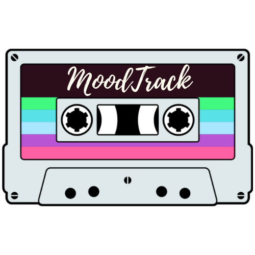

MoodTrack is a Full Stack app that encourages daily mood check-ins and recommends a song based on users’ mood inputs.

Developing a number of features, including:
- A mood check-in / track finder page that allows users to reflect and measure their daily mood using interactive sliders. The inputs are used to generate a random track from the ChatGPT API. The ChatGPT API will provide a reason why the song suits the user's mood.
- Links to listen to the recommended song on the most popular music streaming platforms.
- Downloadable lists of the most recent recommended songs and reasons.
- A mood tracker which allows users to select any seven day period and generate charts based on their historic mood inputs.
